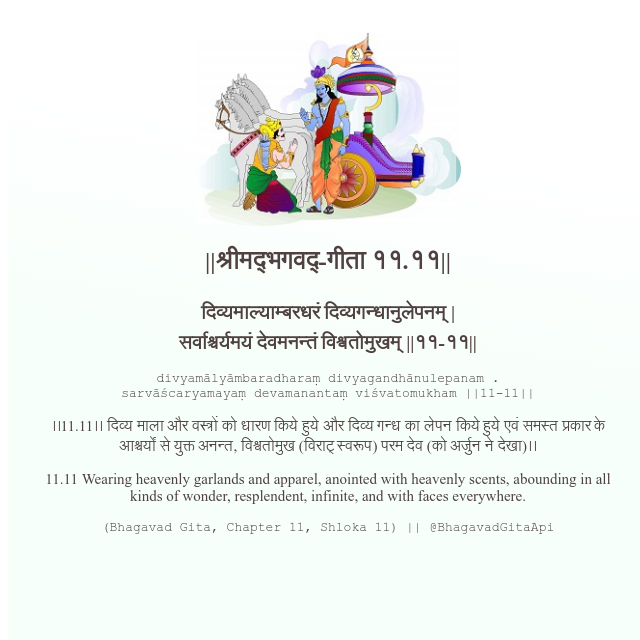

<h2>||श्रीमद्‍भगवद्‍-गीता ११.११||</h2>
<h3>दिव्यमाल्याम्बरधरं दिव्यगन्धानुलेपनम् | सर्वाश्चर्यमयं देवमनन्तं विश्वतोमुखम् ||११-११||</h3>
<pre>divyamālyāmbaradharaṃ divyagandhānulepanam . sarvāścaryamayaṃ devamanantaṃ viśvatomukham ||11-11||</pre>

।।11.11।। दिव्य माला और वस्त्रों को धारण किये हुये और दिव्य गन्ध का लेपन किये हुये एवं समस्त प्रकार के आश्चर्यों से युक्त अनन्त, विश्वतोमुख (विराट् स्वरूप) परम देव (को अर्जुन ने देखा)।।

<pre>(Bhagavad Gita, Chapter 11, Shloka 11) || @BhagavadGitaApi</pre>
https://docs.bhagavadgitaapi.in/

#API #bhagavadgitaapi #slok #nodejs #js #api #gitaapi #krishna #hinduism #vedic #ISKCON #shreemadbhagavadgita #technology

