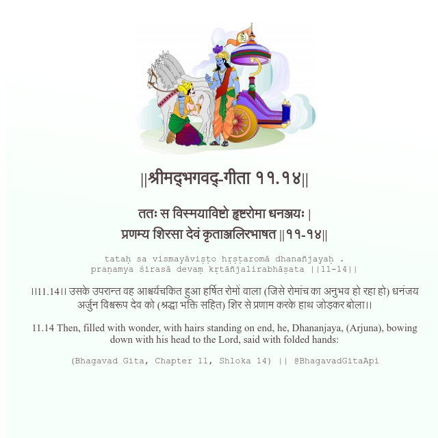

<h2>||श्रीमद्‍भगवद्‍-गीता ११.१४||</h2>
<h3>ततः स विस्मयाविष्टो हृष्टरोमा धनञ्जयः | प्रणम्य शिरसा देवं कृताञ्जलिरभाषत ||११-१४||</h3>
<pre>tataḥ sa vismayāviṣṭo hṛṣṭaromā dhanañjayaḥ . praṇamya śirasā devaṃ kṛtāñjalirabhāṣata ||11-14||</pre>

।।11.14।। उसके उपरान्त वह आश्चर्यचकित हुआ हर्षित रोमों वाला (जिसे रोमांच का अनुभव हो रहा हो) धनंजय अर्जुन विश्वरूप देव को (श्रद्धा भक्ति सहित) शिर से प्रणाम करके हाथ जोड़कर बोला।।

<pre>(Bhagavad Gita, Chapter 11, Shloka 14) || @BhagavadGitaApi</pre>
https://docs.bhagavadgitaapi.in/

#API #bhagavadgitaapi #slok #nodejs #js #api #gitaapi #krishna #hinduism #vedic #ISKCON #shreemadbhagavadgita #technology

