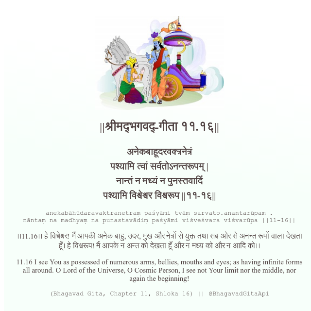

<h2>||श्रीमद्‍भगवद्‍-गीता ११.१६||</h2>
<h3>अनेकबाहूदरवक्त्रनेत्रं पश्यामि त्वां सर्वतोऽनन्तरूपम् | नान्तं न मध्यं न पुनस्तवादिं पश्यामि विश्वेश्वर विश्वरूप ||११-१६||</h3>
<pre>anekabāhūdaravaktranetraṃ paśyāmi tvāṃ sarvato.anantarūpam . nāntaṃ na madhyaṃ na punastavādiṃ paśyāmi viśveśvara viśvarūpa ||11-16||</pre>

।।11.16।। हे विश्वेश्वर! मैं आपकी अनेक बाहु, उदर, मुख और नेत्रों से युक्त तथा सब ओर से अनन्त रूपों वाला देखता हूँ। हे विश्वरूप! मैं आपके न अन्त को देखता हूँ और न मध्य को और न आदि को।।

<pre>(Bhagavad Gita, Chapter 11, Shloka 16) || @BhagavadGitaApi</pre>
https://docs.bhagavadgitaapi.in/

#API #bhagavadgitaapi #slok #nodejs #js #api #gitaapi #krishna #hinduism #vedic #ISKCON #shreemadbhagavadgita #technology

