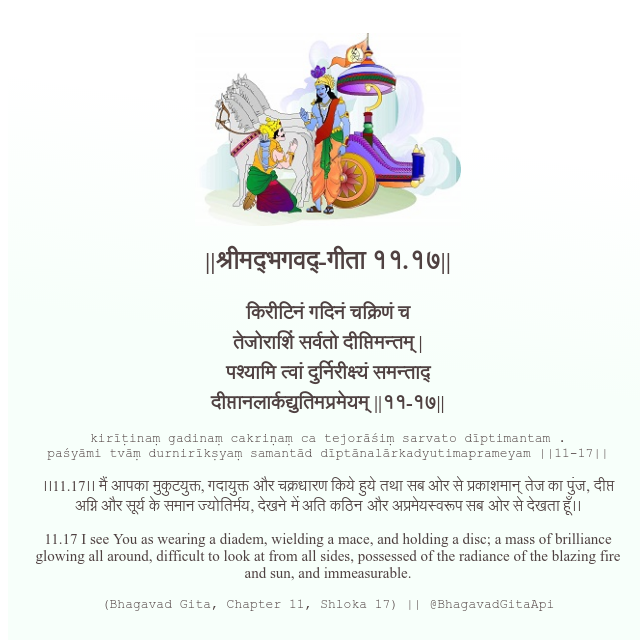

<h2>||श्रीमद्‍भगवद्‍-गीता ११.१७||</h2>
<h3>किरीटिनं गदिनं चक्रिणं च तेजोराशिं सर्वतो दीप्तिमन्तम् | पश्यामि त्वां दुर्निरीक्ष्यं समन्ताद् दीप्तानलार्कद्युतिमप्रमेयम् ||११-१७||</h3>
<pre>kirīṭinaṃ gadinaṃ cakriṇaṃ ca tejorāśiṃ sarvato dīptimantam . paśyāmi tvāṃ durnirīkṣyaṃ samantād dīptānalārkadyutimaprameyam ||11-17||</pre>

।।11.17।। मैं आपका मुकुटयुक्त, गदायुक्त और चक्रधारण किये हुये तथा सब ओर से प्रकाशमान् तेज का पुंज, दीप्त अग्नि और सूर्य के समान ज्योतिर्मय, देखने में अति कठिन और अप्रमेयस्वरूप सब ओर से देखता हूँ।।

<pre>(Bhagavad Gita, Chapter 11, Shloka 17) || @BhagavadGitaApi</pre>
https://bhagavadgitaapi.in/

#API #bhagavadgitaapi #slok #nodejs #js #api #gitaapi #krishna #hinduism #vedic #ISKCON #shreemadbhagavadgita #technology

