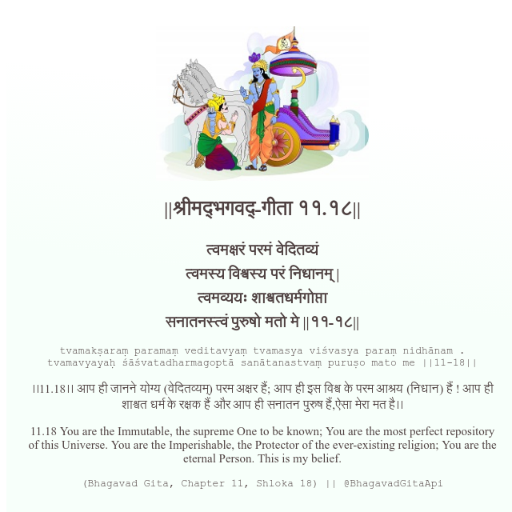

<h2>||श्रीमद्‍भगवद्‍-गीता ११.१८||</h2>
<h3>त्वमक्षरं परमं वेदितव्यं त्वमस्य विश्वस्य परं निधानम् | त्वमव्ययः शाश्वतधर्मगोप्ता सनातनस्त्वं पुरुषो मतो मे ||११-१८||</h3>
<pre>tvamakṣaraṃ paramaṃ veditavyaṃ tvamasya viśvasya paraṃ nidhānam . tvamavyayaḥ śāśvatadharmagoptā sanātanastvaṃ puruṣo mato me ||11-18||</pre>

।।11.18।। आप ही जानने योग्य (वेदितव्यम्) परम अक्षर हैं; आप ही इस विश्व के परम आश्रय (निधान) हैं ! आप ही शाश्वत धर्म के रक्षक हैं और आप ही सनातन पुरुष हैं,ऐसा मेरा मत है।।

<pre>(Bhagavad Gita, Chapter 11, Shloka 18) || @BhagavadGitaApi</pre>
https://bhagavadgitaapi.in/

#API #bhagavadgitaapi #slok #nodejs #js #api #gitaapi #krishna #hinduism #vedic #ISKCON #shreemadbhagavadgita #technology

