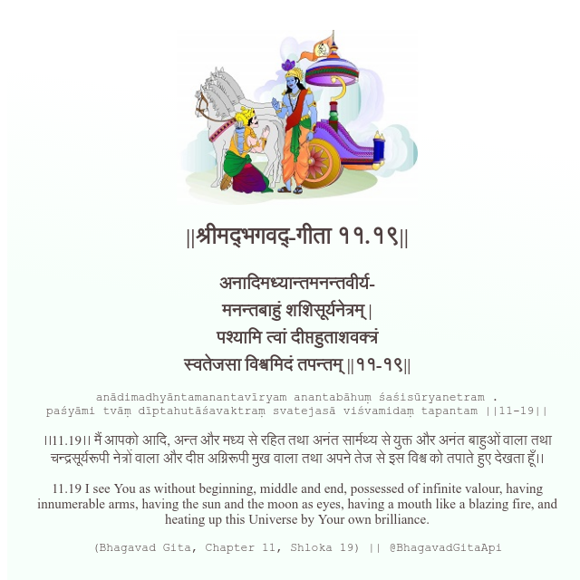

<h2>||श्रीमद्‍भगवद्‍-गीता ११.१९||</h2>
<h3>अनादिमध्यान्तमनन्तवीर्य- मनन्तबाहुं शशिसूर्यनेत्रम् | पश्यामि त्वां दीप्तहुताशवक्त्रं स्वतेजसा विश्वमिदं तपन्तम् ||११-१९||</h3>
<pre>anādimadhyāntamanantavīryam anantabāhuṃ śaśisūryanetram . paśyāmi tvāṃ dīptahutāśavaktraṃ svatejasā viśvamidaṃ tapantam ||11-19||</pre>

।।11.19।। मैं आपको आदि, अन्त और मध्य से रहित तथा अनंत सार्मथ्य से युक्त और अनंत बाहुओं वाला तथा चन्द्रसूर्यरूपी नेत्रों वाला और दीप्त अग्निरूपी मुख वाला तथा अपने तेज से इस विश्व को तपाते हुए देखता हूँ।।

<pre>(Bhagavad Gita, Chapter 11, Shloka 19) || @BhagavadGitaApi</pre>
https://bhagavadgitaapi.in/

#API #bhagavadgitaapi #slok #nodejs #js #api #gitaapi #krishna #hinduism #vedic #ISKCON #shreemadbhagavadgita #technology

