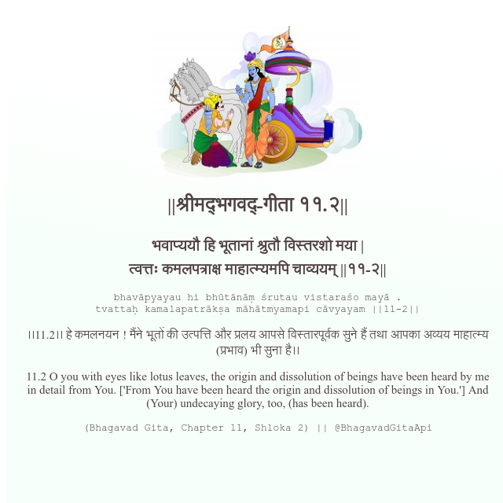

<h2>||श्रीमद्‍भगवद्‍-गीता ११.२||</h2>
<h3>भवाप्ययौ हि भूतानां श्रुतौ विस्तरशो मया | त्वत्तः कमलपत्राक्ष माहात्म्यमपि चाव्ययम् ||११-२||</h3>
<pre>bhavāpyayau hi bhūtānāṃ śrutau vistaraśo mayā . tvattaḥ kamalapatrākṣa māhātmyamapi cāvyayam ||11-2||</pre>

।।11.2।। हे कमलनयन ! मैंने भूतों की उत्पत्ति और प्रलय आपसे विस्तारपूर्वक सुने हैं तथा आपका अव्यय माहात्म्य (प्रभाव) भी सुना है।।

<pre>(Bhagavad Gita, Chapter 11, Shloka 2) || @BhagavadGitaApi</pre>
https://vedicscriptures.github.io/

#API #bhagavadgitaapi #slok #nodejs #js #api #gitaapi #krishna #hinduism #vedic #ISKCON #shreemadbhagavadgita #technology

