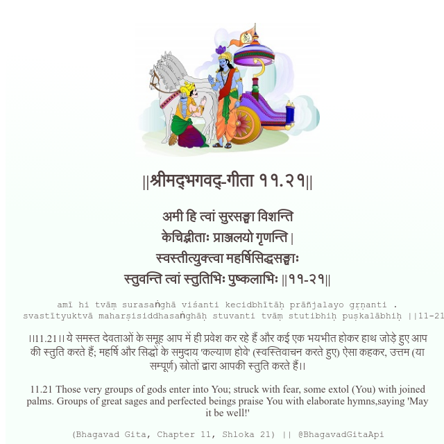

<h2>||श्रीमद्‍भगवद्‍-गीता ११.२१||</h2>
<h3>अमी हि त्वां सुरसङ्घा विशन्ति केचिद्भीताः प्राञ्जलयो गृणन्ति | स्वस्तीत्युक्त्वा महर्षिसिद्धसङ्घाः स्तुवन्ति त्वां स्तुतिभिः पुष्कलाभिः ||११-२१||</h3>
<pre>amī hi tvāṃ surasaṅghā viśanti kecidbhītāḥ prāñjalayo gṛṇanti . svastītyuktvā maharṣisiddhasaṅghāḥ stuvanti tvāṃ stutibhiḥ puṣkalābhiḥ ||11-21||</pre>

।।11.21।। ये समस्त देवताओं के समूह आप में ही प्रवेश कर रहे हैं और कई एक भयभीत होकर हाथ जोड़े हुए आप की स्तुति करते हैं; महर्षि और सिद्धों के समुदाय 'कल्याण होवे' (स्वस्तिवाचन करते हुए) ऐसा कहकर, उत्तम (या सम्पूर्ण) स्रोतों द्वारा आपकी स्तुति करते हैं।।

<pre>(Bhagavad Gita, Chapter 11, Shloka 21) || @BhagavadGitaApi</pre>
https://vedicscriptures.github.io/

#API #bhagavadgitaapi #slok #nodejs #js #api #gitaapi #krishna #hinduism #vedic #ISKCON #shreemadbhagavadgita #technology

