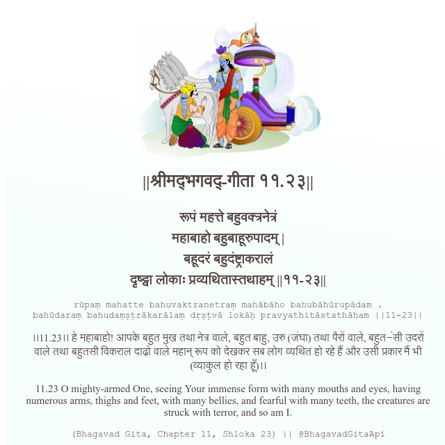

<h2>||श्रीमद्‍भगवद्‍-गीता ११.२३||</h2>
<h3>रूपं महत्ते बहुवक्त्रनेत्रं महाबाहो बहुबाहूरुपादम् | बहूदरं बहुदंष्ट्राकरालं दृष्ट्वा लोकाः प्रव्यथितास्तथाहम् ||११-२३||</h3>
<pre>rūpaṃ mahatte bahuvaktranetraṃ mahābāho bahubāhūrupādam . bahūdaraṃ bahudaṃṣṭrākarālaṃ dṛṣṭvā lokāḥ pravyathitāstathāham ||11-23||</pre>

।।11.23।। हे महाबाहो! आपके बहुत मुख तथा नेत्र वाले, बहुत बाहु, उरु (जंघा) तथा पैरों वाले, बहुत-ंंसी उदरों वाले तथा बहुतसी विकराल दाढ़ों वाले महान् रूप को देखकर सब लोग व्यथित हो रहे हैं और उसी प्रकार मैं भी (व्याकुल हो रहा हूँ)।।

<pre>(Bhagavad Gita, Chapter 11, Shloka 23) || @BhagavadGitaApi</pre>
https://vedicscriptures.github.io/

#API #bhagavadgitaapi #slok #nodejs #js #api #gitaapi #krishna #hinduism #vedic #ISKCON #shreemadbhagavadgita #technology

