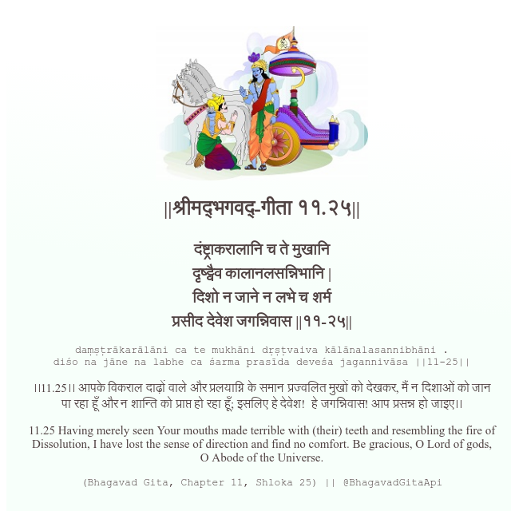

<h2>||श्रीमद्‍भगवद्‍-गीता ११.२५||</h2>
<h3>दंष्ट्राकरालानि च ते मुखानि दृष्ट्वैव कालानलसन्निभानि | दिशो न जाने न लभे च शर्म प्रसीद देवेश जगन्निवास ||११-२५||</h3>
<pre>daṃṣṭrākarālāni ca te mukhāni dṛṣṭvaiva kālānalasannibhāni . diśo na jāne na labhe ca śarma prasīda deveśa jagannivāsa ||11-25||</pre>

।।11.25।। आपके विकराल दाढ़ों वाले और प्रलयाग्नि के समान प्रज्वलित मुखों को देखकर, मैं न दिशाओं को जान पा रहा हूँ और न शान्ति को प्राप्त हो रहा हूँ; इसलिए हे देवेश!  हे जगन्निवास! आप प्रसन्न हो जाइए।।

<pre>(Bhagavad Gita, Chapter 11, Shloka 25) || @BhagavadGitaApi</pre>
https://vedicscriptures.github.io/

#API #bhagavadgitaapi #slok #nodejs #js #api #gitaapi #krishna #hinduism #vedic #ISKCON #shreemadbhagavadgita #technology

