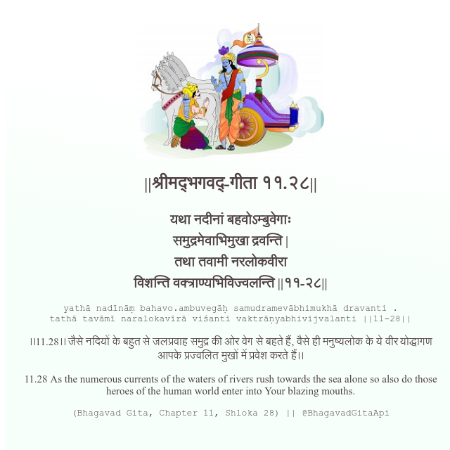

<h2>||श्रीमद्‍भगवद्‍-गीता ११.२८||</h2>
<h3>यथा नदीनां बहवोऽम्बुवेगाः समुद्रमेवाभिमुखा द्रवन्ति | तथा तवामी नरलोकवीरा विशन्ति वक्त्राण्यभिविज्वलन्ति ||११-२८||</h3>
<pre>yathā nadīnāṃ bahavo.ambuvegāḥ samudramevābhimukhā dravanti . tathā tavāmī naralokavīrā viśanti vaktrāṇyabhivijvalanti ||11-28||</pre>

।।11.28।। जैसे नदियों के बहुत से जलप्रवाह समुद्र की ओर वेग से बहते हैं, वैसे ही मनुष्यलोक के ये वीर योद्धागण आपके प्रज्वलित मुखों में प्रवेश करते हैं।।

<pre>(Bhagavad Gita, Chapter 11, Shloka 28) || @BhagavadGitaApi</pre>
https://vedicscriptures.github.io/

#API #bhagavadgitaapi #slok #nodejs #js #api #gitaapi #krishna #hinduism #vedic #ISKCON #shreemadbhagavadgita #technology

