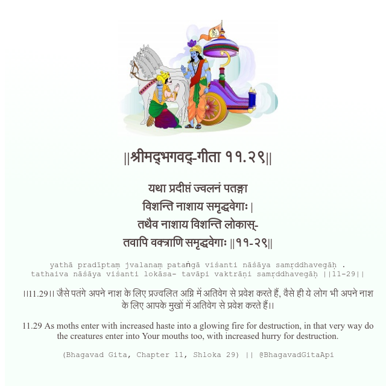

<h2>||श्रीमद्‍भगवद्‍-गीता ११.२९||</h2>
<h3>यथा प्रदीप्तं ज्वलनं पतङ्गा विशन्ति नाशाय समृद्धवेगाः | तथैव नाशाय विशन्ति लोकास्- तवापि वक्त्राणि समृद्धवेगाः ||११-२९||</h3>
<pre>yathā pradīptaṃ jvalanaṃ pataṅgā viśanti nāśāya samṛddhavegāḥ . tathaiva nāśāya viśanti lokāsa- tavāpi vaktrāṇi samṛddhavegāḥ ||11-29||</pre>

।।11.29।। जैसे पतंगे अपने नाश के लिए प्रज्वलित अग्नि में अतिवेग से प्रवेश करते हैं, वैसे ही ये लोग भी अपने नाश के लिए आपके मुखों में अतिवेग से प्रवेश करते हैं।।

<pre>(Bhagavad Gita, Chapter 11, Shloka 29) || @BhagavadGitaApi</pre>
https://docs.bhagavadgitaapi.in/

#API #bhagavadgitaapi #slok #nodejs #js #api #gitaapi #krishna #hinduism #vedic #ISKCON #shreemadbhagavadgita #technology

