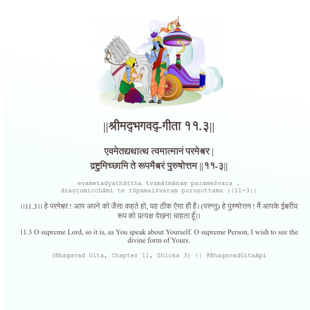

<h2>||श्रीमद्‍भगवद्‍-गीता ११.३||</h2>
<h3>एवमेतद्यथात्थ त्वमात्मानं परमेश्वर | द्रष्टुमिच्छामि ते रूपमैश्वरं पुरुषोत्तम ||११-३||</h3>
<pre>evametadyathāttha tvamātmānaṃ parameśvara . draṣṭumicchāmi te rūpamaiśvaraṃ puruṣottama ||11-3||</pre>

।।11.3।। हे परमेश्वर ! आप अपने को जैसा कहते हो, यह ठीक ऐसा ही है। (परन्तु) हे पुरुषोत्तम ! मैं आपके ईश्वरीय रूप को प्रत्यक्ष देखना चाहता हूँ।।

<pre>(Bhagavad Gita, Chapter 11, Shloka 3) || @BhagavadGitaApi</pre>
https://bhagavadgitaapi.in/

#API #bhagavadgitaapi #slok #nodejs #js #api #gitaapi #krishna #hinduism #vedic #ISKCON #shreemadbhagavadgita #technology

