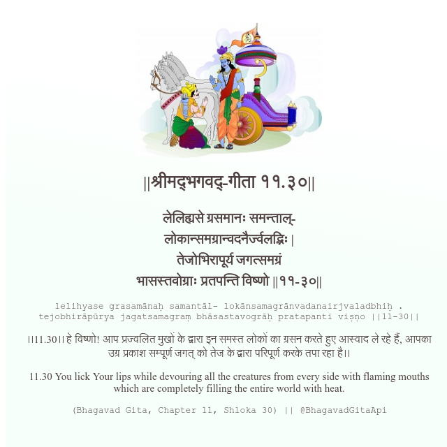

<h2>||श्रीमद्‍भगवद्‍-गीता ११.३०||</h2>
<h3>लेलिह्यसे ग्रसमानः समन्ताल्- लोकान्समग्रान्वदनैर्ज्वलद्भिः | तेजोभिरापूर्य जगत्समग्रं भासस्तवोग्राः प्रतपन्ति विष्णो ||११-३०||</h3>
<pre>lelihyase grasamānaḥ samantāl- lokānsamagrānvadanairjvaladbhiḥ . tejobhirāpūrya jagatsamagraṃ bhāsastavogrāḥ pratapanti viṣṇo ||11-30||</pre>

।।11.30।। हे विष्णो! आप प्रज्वलित मुखों के द्वारा इन समस्त लोकों का ग्रसन करते हुए आस्वाद ले रहे हैं, आपका उग्र प्रकाश सम्पूर्ण जगत् को तेज के द्वारा परिपूर्ण करके तपा रहा है।।

<pre>(Bhagavad Gita, Chapter 11, Shloka 30) || @BhagavadGitaApi</pre>
https://vedicscriptures.github.io/

#API #bhagavadgitaapi #slok #nodejs #js #api #gitaapi #krishna #hinduism #vedic #ISKCON #shreemadbhagavadgita #technology

