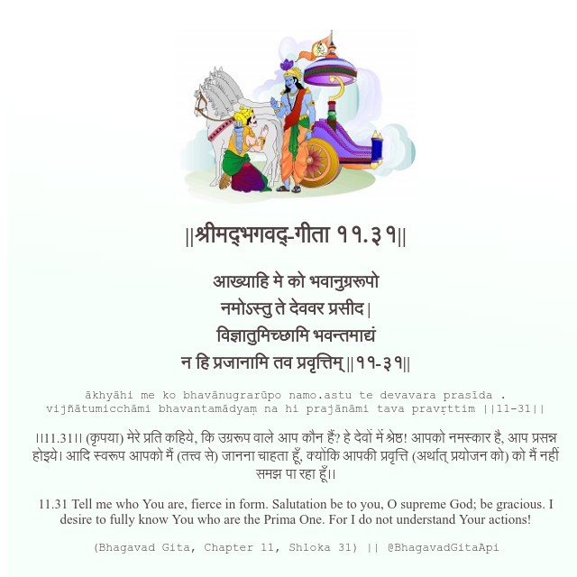

<h2>||श्रीमद्‍भगवद्‍-गीता ११.३१||</h2>
<h3>आख्याहि मे को भवानुग्ररूपो नमोऽस्तु ते देववर प्रसीद | विज्ञातुमिच्छामि भवन्तमाद्यं न हि प्रजानामि तव प्रवृत्तिम् ||११-३१||</h3>
<pre>ākhyāhi me ko bhavānugrarūpo namo.astu te devavara prasīda . vijñātumicchāmi bhavantamādyaṃ na hi prajānāmi tava pravṛttim ||11-31||</pre>

।।11.31।। (कृपया) मेरे प्रति कहिये, कि उग्ररूप वाले आप कौन हैं? हे देवों में श्रेष्ठ! आपको नमस्कार है, आप प्रसन्न होइये। आदि स्वरूप आपको मैं (तत्त्व से) जानना चाहता हूँ, क्योंकि आपकी प्रवृत्ति (अर्थात् प्रयोजन को) को मैं नहीं समझ पा रहा हूँ।।

<pre>(Bhagavad Gita, Chapter 11, Shloka 31) || @BhagavadGitaApi</pre>
https://docs.bhagavadgitaapi.in/

#API #bhagavadgitaapi #slok #nodejs #js #api #gitaapi #krishna #hinduism #vedic #ISKCON #shreemadbhagavadgita #technology

