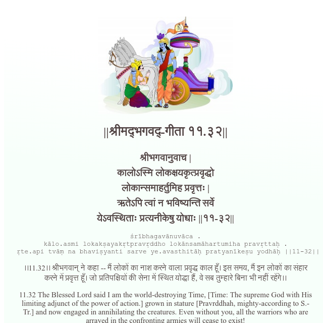

<h2>||श्रीमद्‍भगवद्‍-गीता ११.३२||</h2>
<h3>श्रीभगवानुवाच | कालोऽस्मि लोकक्षयकृत्प्रवृद्धो लोकान्समाहर्तुमिह प्रवृत्तः | ऋतेऽपि त्वां न भविष्यन्ति सर्वे येऽवस्थिताः प्रत्यनीकेषु योधाः ||११-३२||</h3>
<pre>śrībhagavānuvāca . kālo.asmi lokakṣayakṛtpravṛddho lokānsamāhartumiha pravṛttaḥ . ṛte.api tvāṃ na bhaviṣyanti sarve ye.avasthitāḥ pratyanīkeṣu yodhāḥ ||11-32||</pre>

।।11.32।। श्रीभगवान् ने कहा -- मैं लोकों का नाश करने वाला प्रवृद्ध काल हूँ। इस समय, मैं इन लोकों का संहार करने में प्रवृत्त हूँ। जो प्रतिपक्षियों की सेना में स्थित योद्धा हैं, वे सब तुम्हारे बिना भी नहीं रहेंगे।।

<pre>(Bhagavad Gita, Chapter 11, Shloka 32) || @BhagavadGitaApi</pre>
https://docs.bhagavadgitaapi.in/

#API #bhagavadgitaapi #slok #nodejs #js #api #gitaapi #krishna #hinduism #vedic #ISKCON #shreemadbhagavadgita #technology

