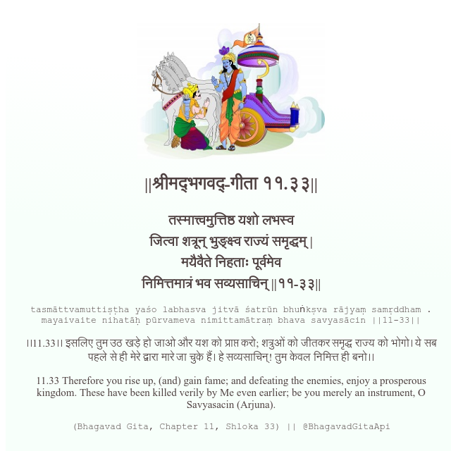

<h2>||श्रीमद्‍भगवद्‍-गीता ११.३३||</h2>
<h3>तस्मात्त्वमुत्तिष्ठ यशो लभस्व जित्वा शत्रून् भुङ्क्ष्व राज्यं समृद्धम् | मयैवैते निहताः पूर्वमेव निमित्तमात्रं भव सव्यसाचिन् ||११-३३||</h3>
<pre>tasmāttvamuttiṣṭha yaśo labhasva jitvā śatrūn bhuṅkṣva rājyaṃ samṛddham . mayaivaite nihatāḥ pūrvameva nimittamātraṃ bhava savyasācin ||11-33||</pre>

।।11.33।। इसलिए तुम उठ खड़े हो जाओ और यश को प्राप्त करो; शत्रुओं को जीतकर समृद्ध राज्य को भोगो। ये सब पहले से ही मेरे द्वारा मारे जा चुके हैं। हे सव्यसाचिन्! तुम केवल निमित्त ही बनो।।

<pre>(Bhagavad Gita, Chapter 11, Shloka 33) || @BhagavadGitaApi</pre>
https://vedicscriptures.github.io/

#API #bhagavadgitaapi #slok #nodejs #js #api #gitaapi #krishna #hinduism #vedic #ISKCON #shreemadbhagavadgita #technology

