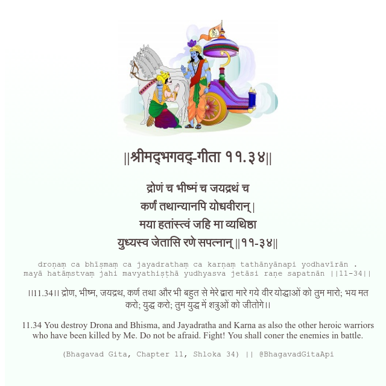

<h2>||श्रीमद्‍भगवद्‍-गीता ११.३४||</h2>
<h3>द्रोणं च भीष्मं च जयद्रथं च कर्णं तथान्यानपि योधवीरान् | मया हतांस्त्वं जहि मा व्यथिष्ठा युध्यस्व जेतासि रणे सपत्नान् ||११-३४||</h3>
<pre>droṇaṃ ca bhīṣmaṃ ca jayadrathaṃ ca karṇaṃ tathānyānapi yodhavīrān . mayā hatāṃstvaṃ jahi mavyathiṣṭhā yudhyasva jetāsi raṇe sapatnān ||11-34||</pre>

।।11.34।। द्रोण, भीष्म, जयद्रथ, कर्ण तथा और भी बहुत से मेरे द्वारा मारे गये वीर योद्धाओं को तुम मारो; भय मत करो; युद्ध करो; तुम युद्ध में शत्रुओं को जीतोगे।।

<pre>(Bhagavad Gita, Chapter 11, Shloka 34) || @BhagavadGitaApi</pre>
https://docs.bhagavadgitaapi.in/

#API #bhagavadgitaapi #slok #nodejs #js #api #gitaapi #krishna #hinduism #vedic #ISKCON #shreemadbhagavadgita #technology

