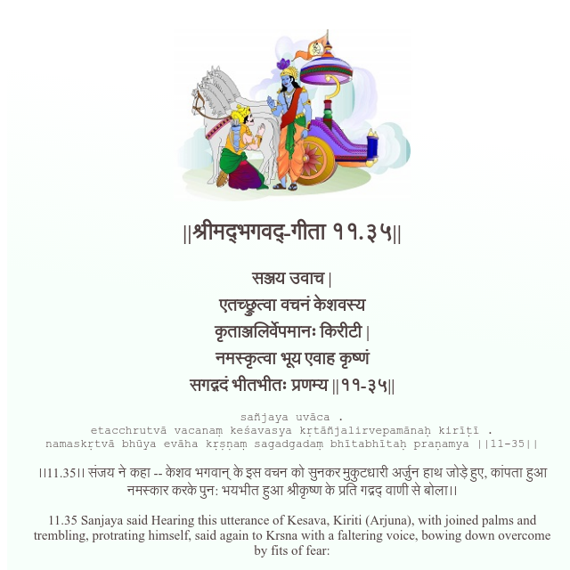

<h2>||श्रीमद्‍भगवद्‍-गीता ११.३५||</h2>
<h3>सञ्जय उवाच | एतच्छ्रुत्वा वचनं केशवस्य कृताञ्जलिर्वेपमानः किरीटी | नमस्कृत्वा भूय एवाह कृष्णं सगद्गदं भीतभीतः प्रणम्य ||११-३५||</h3>
<pre>sañjaya uvāca . etacchrutvā vacanaṃ keśavasya kṛtāñjalirvepamānaḥ kirīṭī . namaskṛtvā bhūya evāha kṛṣṇaṃ sagadgadaṃ bhītabhītaḥ praṇamya ||11-35||</pre>

।।11.35।। संजय ने कहा -- केशव भगवान् के इस वचन को सुनकर मुकुटधारी अर्जुन हाथ जोड़े हुए, कांपता हुआ नमस्कार करके पुन: भयभीत हुआ श्रीकृष्ण के प्रति गद्गद् वाणी से बोला।।

<pre>(Bhagavad Gita, Chapter 11, Shloka 35) || @BhagavadGitaApi</pre>
https://docs.bhagavadgitaapi.in/

#API #bhagavadgitaapi #slok #nodejs #js #api #gitaapi #krishna #hinduism #vedic #ISKCON #shreemadbhagavadgita #technology

