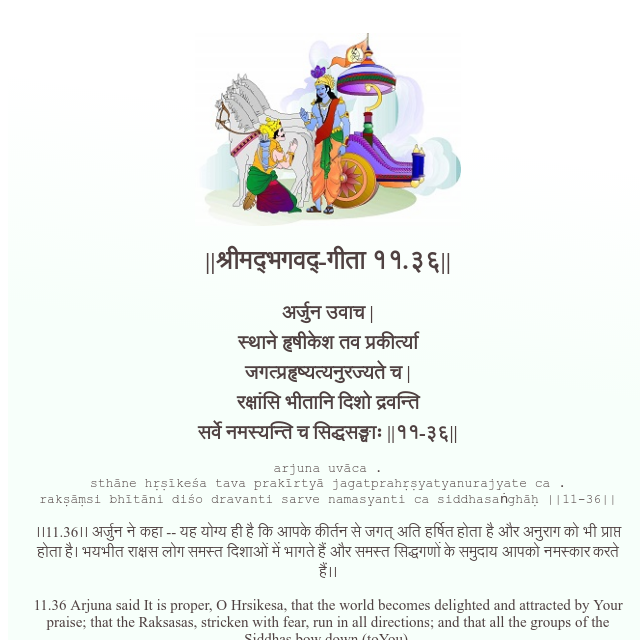

<h2>||श्रीमद्‍भगवद्‍-गीता ११.३६||</h2>
<h3>अर्जुन उवाच | स्थाने हृषीकेश तव प्रकीर्त्या जगत्प्रहृष्यत्यनुरज्यते च | रक्षांसि भीतानि दिशो द्रवन्ति सर्वे नमस्यन्ति च सिद्धसङ्घाः ||११-३६||</h3>
<pre>arjuna uvāca . sthāne hṛṣīkeśa tava prakīrtyā jagatprahṛṣyatyanurajyate ca . rakṣāṃsi bhītāni diśo dravanti sarve namasyanti ca siddhasaṅghāḥ ||11-36||</pre>

।।11.36।। अर्जुन ने कहा -- यह योग्य ही है कि आपके कीर्तन से जगत् अति हर्षित होता है और अनुराग को भी प्राप्त होता है। भयभीत राक्षस लोग समस्त दिशाओं में भागते हैं और समस्त सिद्धगणों के समुदाय आपको नमस्कार करते हैं।।

<pre>(Bhagavad Gita, Chapter 11, Shloka 36) || @BhagavadGitaApi</pre>
https://docs.bhagavadgitaapi.in/

#API #bhagavadgitaapi #slok #nodejs #js #api #gitaapi #krishna #hinduism #vedic #ISKCON #shreemadbhagavadgita #technology

