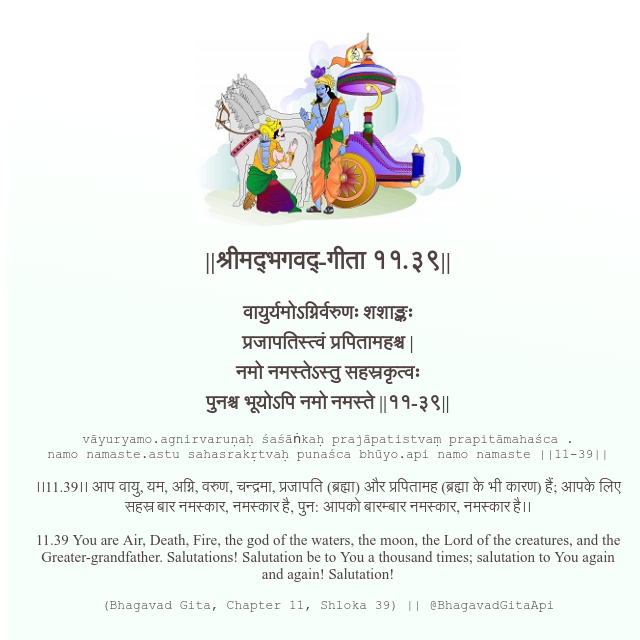

<h2>||श्रीमद्‍भगवद्‍-गीता ११.३९||</h2>
<h3>वायुर्यमोऽग्निर्वरुणः शशाङ्कः प्रजापतिस्त्वं प्रपितामहश्च | नमो नमस्तेऽस्तु सहस्रकृत्वः पुनश्च भूयोऽपि नमो नमस्ते ||११-३९||</h3>
<pre>vāyuryamo.agnirvaruṇaḥ śaśāṅkaḥ prajāpatistvaṃ prapitāmahaśca . namo namaste.astu sahasrakṛtvaḥ punaśca bhūyo.api namo namaste ||11-39||</pre>

।।11.39।। आप वायु, यम, अग्नि, वरुण, चन्द्रमा, प्रजापति (ब्रह्मा) और प्रपितामह (ब्रह्मा के भी कारण) हैं; आपके लिए सहस्र बार नमस्कार, नमस्कार है, पुन: आपको बारम्बार नमस्कार, नमस्कार है।।

<pre>(Bhagavad Gita, Chapter 11, Shloka 39) || @BhagavadGitaApi</pre>
https://bhagavadgitaapi.in/

#API #bhagavadgitaapi #slok #nodejs #js #api #gitaapi #krishna #hinduism #vedic #ISKCON #shreemadbhagavadgita #technology

