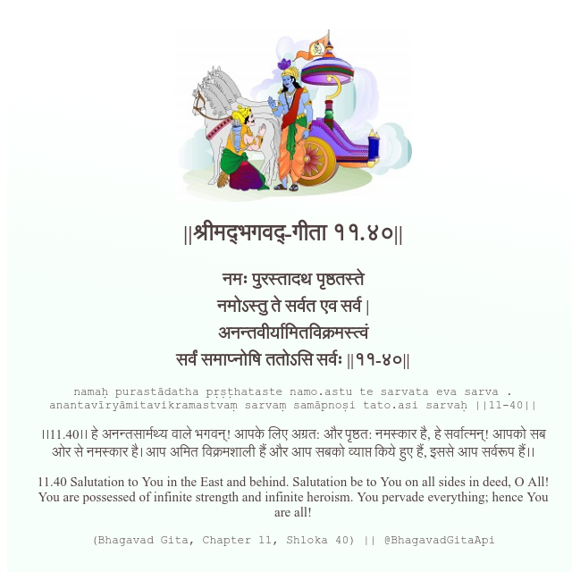

<h2>||श्रीमद्‍भगवद्‍-गीता ११.४०||</h2>
<h3>नमः पुरस्तादथ पृष्ठतस्ते नमोऽस्तु ते सर्वत एव सर्व | अनन्तवीर्यामितविक्रमस्त्वं सर्वं समाप्नोषि ततोऽसि सर्वः ||११-४०||</h3>
<pre>namaḥ purastādatha pṛṣṭhataste namo.astu te sarvata eva sarva . anantavīryāmitavikramastvaṃ sarvaṃ samāpnoṣi tato.asi sarvaḥ ||11-40||</pre>

।।11.40।। हे अनन्तसार्मथ्य वाले भगवन्! आपके लिए अग्रत: और पृष्ठत: नमस्कार है, हे सर्वात्मन्! आपको सब ओर से नमस्कार है। आप अमित विक्रमशाली हैं और आप सबको व्याप्त किये हुए हैं, इससे आप सर्वरूप हैं।।

<pre>(Bhagavad Gita, Chapter 11, Shloka 40) || @BhagavadGitaApi</pre>
https://bhagavadgitaapi.in/

#API #bhagavadgitaapi #slok #nodejs #js #api #gitaapi #krishna #hinduism #vedic #ISKCON #shreemadbhagavadgita #technology

