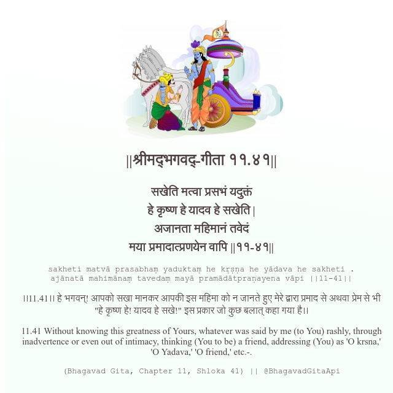

<h2>||श्रीमद्‍भगवद्‍-गीता ११.४१||</h2>
<h3>सखेति मत्वा प्रसभं यदुक्तं हे कृष्ण हे यादव हे सखेति | अजानता महिमानं तवेदं मया प्रमादात्प्रणयेन वापि ||११-४१||</h3>
<pre>sakheti matvā prasabhaṃ yaduktaṃ he kṛṣṇa he yādava he sakheti . ajānatā mahimānaṃ tavedaṃ mayā pramādātpraṇayena vāpi ||11-41||</pre>

।।11.41।। हे भगवन्! आपको सखा मानकर आपकी इस महिमा को न जानते हुए मेरे द्वारा प्रमाद से अथवा प्रेम से भी "हे कृष्ण हे! यादव हे सखे!" इस प्रकार जो कुछ बलात् कहा गया है।।

<pre>(Bhagavad Gita, Chapter 11, Shloka 41) || @BhagavadGitaApi</pre>
https://docs.bhagavadgitaapi.in/

#API #bhagavadgitaapi #slok #nodejs #js #api #gitaapi #krishna #hinduism #vedic #ISKCON #shreemadbhagavadgita #technology

