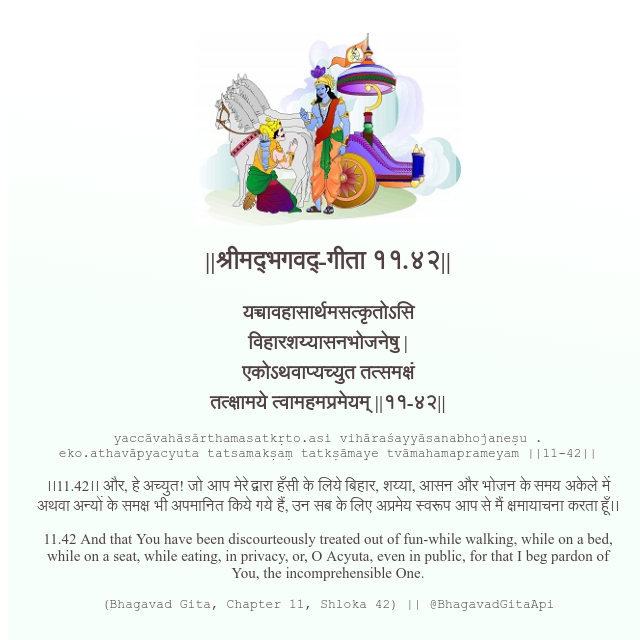

<h2>||श्रीमद्‍भगवद्‍-गीता ११.४२||</h2>
<h3>यच्चावहासार्थमसत्कृतोऽसि विहारशय्यासनभोजनेषु | एकोऽथवाप्यच्युत तत्समक्षं तत्क्षामये त्वामहमप्रमेयम् ||११-४२||</h3>
<pre>yaccāvahāsārthamasatkṛto.asi vihāraśayyāsanabhojaneṣu . eko.athavāpyacyuta tatsamakṣaṃ tatkṣāmaye tvāmahamaprameyam ||11-42||</pre>

।।11.42।। और, हे अच्युत! जो आप मेरे द्वारा हँसी के लिये बिहार, शय्या, आसन और भोजन के समय अकेले में अथवा अन्यों के समक्ष भी अपमानित किये गये हैं, उन सब के लिए अप्रमेय स्वरूप आप से मैं क्षमायाचना करता हूँ।।

<pre>(Bhagavad Gita, Chapter 11, Shloka 42) || @BhagavadGitaApi</pre>
https://bhagavadgitaapi.in/

#API #bhagavadgitaapi #slok #nodejs #js #api #gitaapi #krishna #hinduism #vedic #ISKCON #shreemadbhagavadgita #technology

