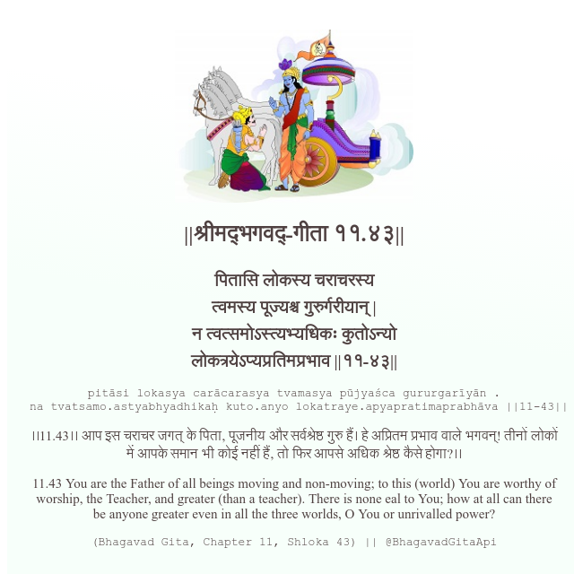

<h2>||श्रीमद्‍भगवद्‍-गीता ११.४३||</h2>
<h3>पितासि लोकस्य चराचरस्य त्वमस्य पूज्यश्च गुरुर्गरीयान् | न त्वत्समोऽस्त्यभ्यधिकः कुतोऽन्यो लोकत्रयेऽप्यप्रतिमप्रभाव ||११-४३||</h3>
<pre>pitāsi lokasya carācarasya tvamasya pūjyaśca gururgarīyān . na tvatsamo.astyabhyadhikaḥ kuto.anyo lokatraye.apyapratimaprabhāva ||11-43||</pre>

।।11.43।। आप इस चराचर जगत् के पिता, पूजनीय और सर्वश्रेष्ठ गुरु हैं। हे अप्रितम प्रभाव वाले भगवन्! तीनों लोकों में आपके समान भी कोई नहीं हैं, तो फिर आपसे अधिक श्रेष्ठ कैसे होगा?।।

<pre>(Bhagavad Gita, Chapter 11, Shloka 43) || @BhagavadGitaApi</pre>
https://vedicscriptures.github.io/

#API #bhagavadgitaapi #slok #nodejs #js #api #gitaapi #krishna #hinduism #vedic #ISKCON #shreemadbhagavadgita #technology

