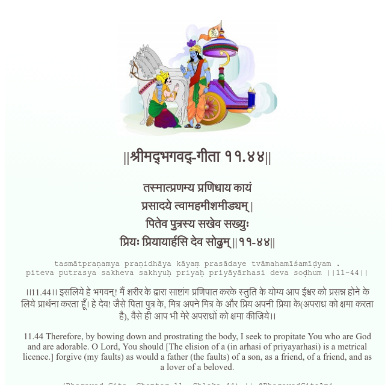

<h2>||श्रीमद्‍भगवद्‍-गीता ११.४४||</h2>
<h3>तस्मात्प्रणम्य प्रणिधाय कायं प्रसादये त्वामहमीशमीड्यम् | पितेव पुत्रस्य सखेव सख्युः प्रियः प्रियायार्हसि देव सोढुम् ||११-४४||</h3>
<pre>tasmātpraṇamya praṇidhāya kāyaṃ prasādaye tvāmahamīśamīḍyam . piteva putrasya sakheva sakhyuḥ priyaḥ priyāyārhasi deva soḍhum ||11-44||</pre>

।।11.44।। इसलिये हे भगवन्! मैं शरीर के द्वारा साष्टांग प्रणिपात करके स्तुति के योग्य आप ईश्वर को प्रसन्न होने के लिये प्रार्थना करता हूँ। हे देव! जैसे पिता पुत्र के, मित्र अपने मित्र के और प्रिय अपनी प्रिया के(अपराध को क्षमा करता है), वैसे ही आप भी मेरे अपराधों को क्षमा कीजिये।।

<pre>(Bhagavad Gita, Chapter 11, Shloka 44) || @BhagavadGitaApi</pre>
https://vedicscriptures.github.io/

#API #bhagavadgitaapi #slok #nodejs #js #api #gitaapi #krishna #hinduism #vedic #ISKCON #shreemadbhagavadgita #technology

