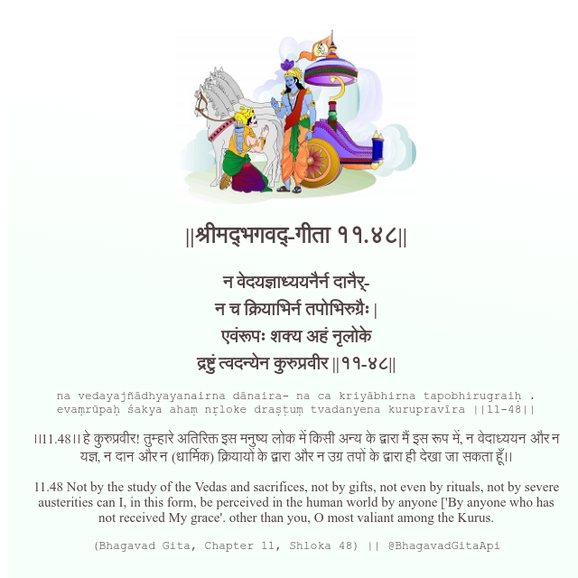

<h2>||श्रीमद्‍भगवद्‍-गीता ११.४८||</h2>
<h3>न वेदयज्ञाध्ययनैर्न दानैर्- न च क्रियाभिर्न तपोभिरुग्रैः | एवंरूपः शक्य अहं नृलोके द्रष्टुं त्वदन्येन कुरुप्रवीर ||११-४८||</h3>
<pre>na vedayajñādhyayanairna dānaira- na ca kriyābhirna tapobhirugraiḥ . evaṃrūpaḥ śakya ahaṃ nṛloke draṣṭuṃ tvadanyena kurupravīra ||11-48||</pre>

।।11.48।। हे कुरुप्रवीर! तुम्हारे अतिरिक्त इस मनुष्य लोक में किसी अन्य के द्वारा मैं इस रूप में, न वेदाध्ययन और न यज्ञ, न दान और न (धार्मिक) क्रियायों के द्वारा और न उग्र तपों के द्वारा ही देखा जा सकता हूँ।।

<pre>(Bhagavad Gita, Chapter 11, Shloka 48) || @BhagavadGitaApi</pre>
https://docs.bhagavadgitaapi.in/

#API #bhagavadgitaapi #slok #nodejs #js #api #gitaapi #krishna #hinduism #vedic #ISKCON #shreemadbhagavadgita #technology

