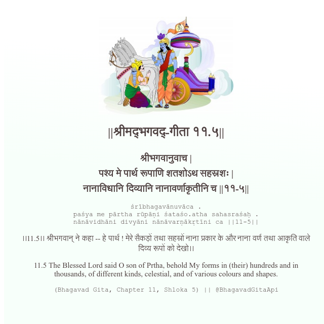

<h2>||श्रीमद्‍भगवद्‍-गीता ११.५||</h2>
<h3>श्रीभगवानुवाच | पश्य मे पार्थ रूपाणि शतशोऽथ सहस्रशः | नानाविधानि दिव्यानि नानावर्णाकृतीनि च ||११-५||</h3>
<pre>śrībhagavānuvāca . paśya me pārtha rūpāṇi śataśo.atha sahasraśaḥ . nānāvidhāni divyāni nānāvarṇākṛtīni ca ||11-5||</pre>

।।11.5।। श्रीभगवान् ने कहा -- हे पार्थ ! मेरे सैकड़ों तथा सहस्रों नाना प्रकार के और नाना वर्ण तथा आकृति वाले दिव्य रूपों को देखो।।

<pre>(Bhagavad Gita, Chapter 11, Shloka 5) || @BhagavadGitaApi</pre>
https://vedicscriptures.github.io/

#API #bhagavadgitaapi #slok #nodejs #js #api #gitaapi #krishna #hinduism #vedic #ISKCON #shreemadbhagavadgita #technology

