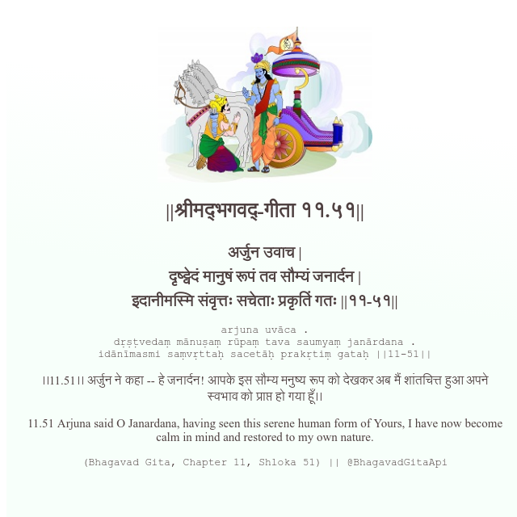

<h2>||श्रीमद्‍भगवद्‍-गीता ११.५१||</h2>
<h3>अर्जुन उवाच | दृष्ट्वेदं मानुषं रूपं तव सौम्यं जनार्दन | इदानीमस्मि संवृत्तः सचेताः प्रकृतिं गतः ||११-५१||</h3>
<pre>arjuna uvāca . dṛṣṭvedaṃ mānuṣaṃ rūpaṃ tava saumyaṃ janārdana . idānīmasmi saṃvṛttaḥ sacetāḥ prakṛtiṃ gataḥ ||11-51||</pre>

।।11.51।। अर्जुन ने कहा -- हे जनार्दन! आपके इस सौम्य मनुष्य रूप को देखकर अब मैं शांतचित्त हुआ अपने स्वभाव को प्राप्त हो गया हूँ।।

<pre>(Bhagavad Gita, Chapter 11, Shloka 51) || @BhagavadGitaApi</pre>
https://bhagavadgitaapi.in/

#API #bhagavadgitaapi #slok #nodejs #js #api #gitaapi #krishna #hinduism #vedic #ISKCON #shreemadbhagavadgita #technology

