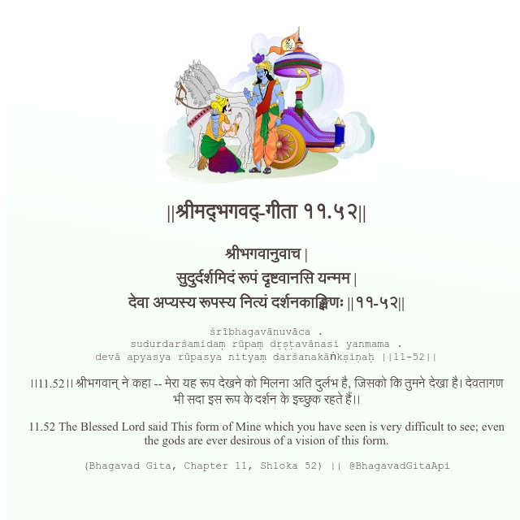

<h2>||श्रीमद्‍भगवद्‍-गीता ११.५२||</h2>
<h3>श्रीभगवानुवाच | सुदुर्दर्शमिदं रूपं दृष्टवानसि यन्मम | देवा अप्यस्य रूपस्य नित्यं दर्शनकाङ्क्षिणः ||११-५२||</h3>
<pre>śrībhagavānuvāca . sudurdarśamidaṃ rūpaṃ dṛṣṭavānasi yanmama . devā apyasya rūpasya nityaṃ darśanakāṅkṣiṇaḥ ||11-52||</pre>

।।11.52।। श्रीभगवान् ने कहा -- मेरा यह रूप देखने को मिलना अति दुर्लभ है, जिसको कि तुमने देखा है। देवतागण भी सदा इस रूप के दर्शन के इच्छुक रहते हैं।।

<pre>(Bhagavad Gita, Chapter 11, Shloka 52) || @BhagavadGitaApi</pre>
https://bhagavadgitaapi.in/

#API #bhagavadgitaapi #slok #nodejs #js #api #gitaapi #krishna #hinduism #vedic #ISKCON #shreemadbhagavadgita #technology

