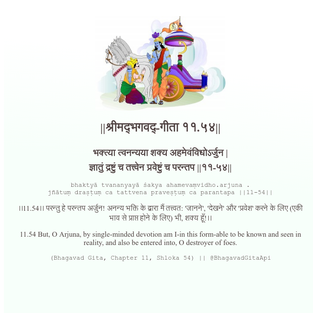

<h2>||श्रीमद्‍भगवद्‍-गीता ११.५४||</h2>
<h3>भक्त्या त्वनन्यया शक्य अहमेवंविधोऽर्जुन | ज्ञातुं द्रष्टुं च तत्त्वेन प्रवेष्टुं च परन्तप ||११-५४||</h3>
<pre>bhaktyā tvananyayā śakya ahamevaṃvidho.arjuna . jñātuṃ draṣṭuṃ ca tattvena praveṣṭuṃ ca parantapa ||11-54||</pre>

।।11.54।। परन्तु हे परन्तप अर्जुन! अनन्य भक्ति के द्वारा मैं तत्त्वत: 'जानने', 'देखने' और 'प्रवेश' करने के लिए (एकी भाव से प्राप्त होने के लिए) भी, शक्य हूँ!।।

<pre>(Bhagavad Gita, Chapter 11, Shloka 54) || @BhagavadGitaApi</pre>
https://bhagavadgitaapi.in/

#API #bhagavadgitaapi #slok #nodejs #js #api #gitaapi #krishna #hinduism #vedic #ISKCON #shreemadbhagavadgita #technology

