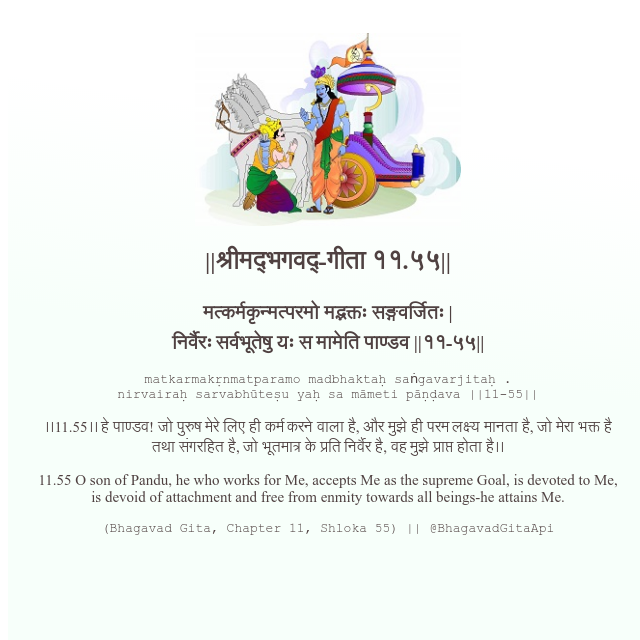

<h2>||श्रीमद्‍भगवद्‍-गीता ११.५५||</h2>
<h3>मत्कर्मकृन्मत्परमो मद्भक्तः सङ्गवर्जितः | निर्वैरः सर्वभूतेषु यः स मामेति पाण्डव ||११-५५||</h3>
<pre>matkarmakṛnmatparamo madbhaktaḥ saṅgavarjitaḥ . nirvairaḥ sarvabhūteṣu yaḥ sa māmeti pāṇḍava ||11-55||</pre>

।।11.55।। हे पाण्डव! जो पुरुष मेरे लिए ही कर्म करने वाला है, और मुझे ही परम लक्ष्य मानता है, जो मेरा भक्त है तथा संगरहित है, जो भूतमात्र के प्रति निर्वैर है, वह मुझे प्राप्त होता है।।

<pre>(Bhagavad Gita, Chapter 11, Shloka 55) || @BhagavadGitaApi</pre>
https://bhagavadgitaapi.in/

#API #bhagavadgitaapi #slok #nodejs #js #api #gitaapi #krishna #hinduism #vedic #ISKCON #shreemadbhagavadgita #technology

