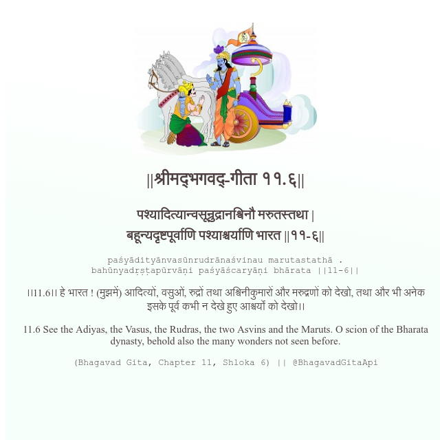

<h2>||श्रीमद्‍भगवद्‍-गीता ११.६||</h2>
<h3>पश्यादित्यान्वसून्रुद्रानश्विनौ मरुतस्तथा | बहून्यदृष्टपूर्वाणि पश्याश्चर्याणि भारत ||११-६||</h3>
<pre>paśyādityānvasūnrudrānaśvinau marutastathā . bahūnyadṛṣṭapūrvāṇi paśyāścaryāṇi bhārata ||11-6||</pre>

।।11.6।। हे भारत ! (मुझमें) आदित्यों, वसुओं, रुद्रों तथा अश्विनीकुमारों और मरुद्गणों को देखो, तथा और भी अनेक इसके पूर्व कभी न देखे हुए आश्चर्यों को देखो।।

<pre>(Bhagavad Gita, Chapter 11, Shloka 6) || @BhagavadGitaApi</pre>
https://bhagavadgitaapi.in/

#API #bhagavadgitaapi #slok #nodejs #js #api #gitaapi #krishna #hinduism #vedic #ISKCON #shreemadbhagavadgita #technology

