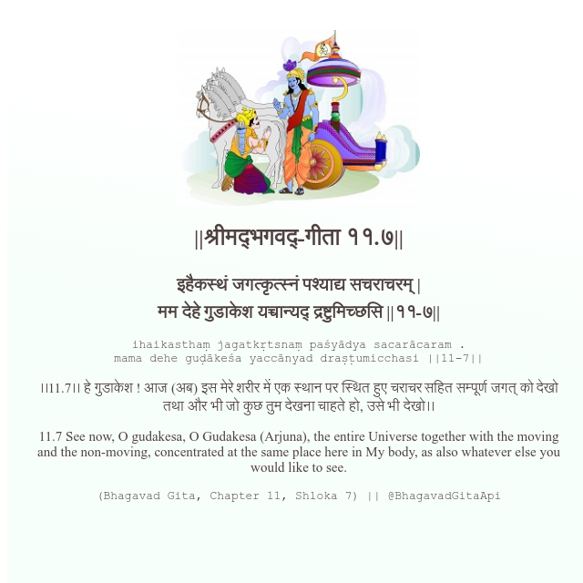

<h2>||श्रीमद्‍भगवद्‍-गीता ११.७||</h2>
<h3>इहैकस्थं जगत्कृत्स्नं पश्याद्य सचराचरम् | मम देहे गुडाकेश यच्चान्यद् द्रष्टुमिच्छसि ||११-७||</h3>
<pre>ihaikasthaṃ jagatkṛtsnaṃ paśyādya sacarācaram . mama dehe guḍākeśa yaccānyad draṣṭumicchasi ||11-7||</pre>

।।11.7।। हे गुडाकेश ! आज (अब) इस मेरे शरीर में एक स्थान पर स्थित हुए चराचर सहित सम्पूर्ण जगत् को देखो तथा और भी जो कुछ तुम देखना चाहते हो, उसे भी देखो।।

<pre>(Bhagavad Gita, Chapter 11, Shloka 7) || @BhagavadGitaApi</pre>
https://vedicscriptures.github.io/

#API #bhagavadgitaapi #slok #nodejs #js #api #gitaapi #krishna #hinduism #vedic #ISKCON #shreemadbhagavadgita #technology

