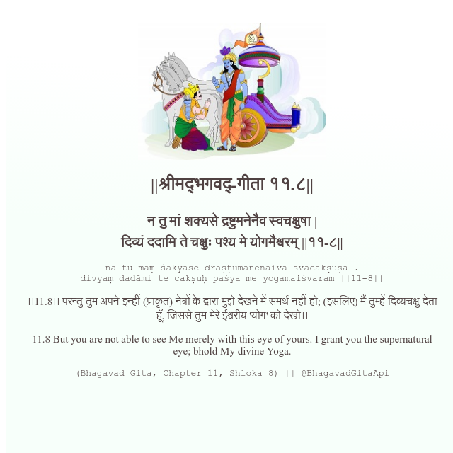

<h2>||श्रीमद्‍भगवद्‍-गीता ११.८||</h2>
<h3>न तु मां शक्यसे द्रष्टुमनेनैव स्वचक्षुषा | दिव्यं ददामि ते चक्षुः पश्य मे योगमैश्वरम् ||११-८||</h3>
<pre>na tu māṃ śakyase draṣṭumanenaiva svacakṣuṣā . divyaṃ dadāmi te cakṣuḥ paśya me yogamaiśvaram ||11-8||</pre>

।।11.8।। परन्तु तुम अपने इन्हीं (प्राकृत) नेत्रों के द्वारा मुझे देखने में समर्थ नहीं हो; (इसलिए) मैं तुम्हें दिव्यचक्षु देता हूँ, जिससे तुम मेरे ईश्वरीय 'योग' को देखो।।

<pre>(Bhagavad Gita, Chapter 11, Shloka 8) || @BhagavadGitaApi</pre>
https://bhagavadgitaapi.in/

#API #bhagavadgitaapi #slok #nodejs #js #api #gitaapi #krishna #hinduism #vedic #ISKCON #shreemadbhagavadgita #technology

