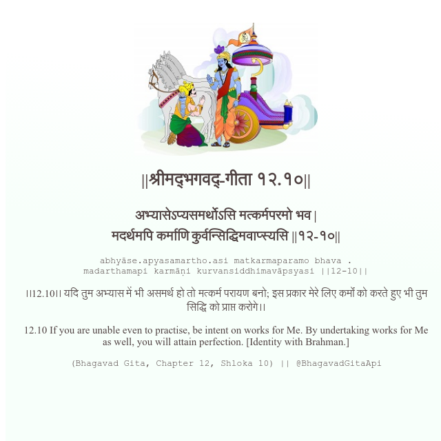

<h2>||श्रीमद्‍भगवद्‍-गीता १२.१०||</h2>
<h3>अभ्यासेऽप्यसमर्थोऽसि मत्कर्मपरमो भव | मदर्थमपि कर्माणि कुर्वन्सिद्धिमवाप्स्यसि ||१२-१०||</h3>
<pre>abhyāse.apyasamartho.asi matkarmaparamo bhava . madarthamapi karmāṇi kurvansiddhimavāpsyasi ||12-10||</pre>

।।12.10।। यदि तुम अभ्यास में भी असमर्थ हो तो मत्कर्म परायण बनो; इस प्रकार मेरे लिए कर्मों को करते हुए भी तुम सिद्धि को प्राप्त करोगे।।

<pre>(Bhagavad Gita, Chapter 12, Shloka 10) || @BhagavadGitaApi</pre>
https://docs.bhagavadgitaapi.in/

#API #bhagavadgitaapi #slok #nodejs #js #api #gitaapi #krishna #hinduism #vedic #ISKCON #shreemadbhagavadgita #technology

