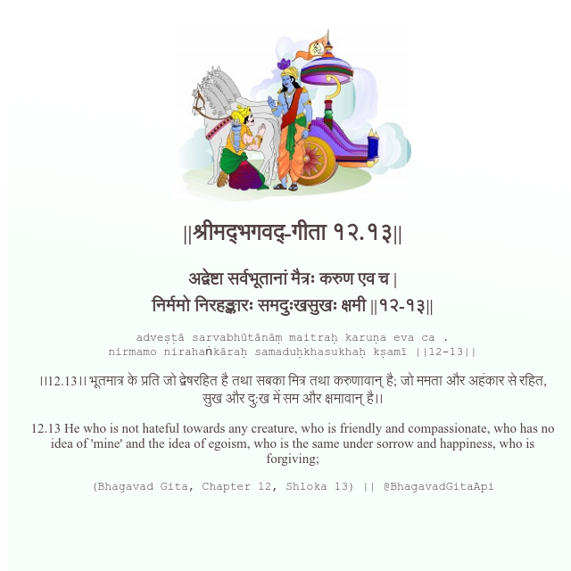

<h2>||श्रीमद्‍भगवद्‍-गीता १२.१३||</h2>
<h3>अद्वेष्टा सर्वभूतानां मैत्रः करुण एव च | निर्ममो निरहङ्कारः समदुःखसुखः क्षमी ||१२-१३||</h3>
<pre>adveṣṭā sarvabhūtānāṃ maitraḥ karuṇa eva ca . nirmamo nirahaṅkāraḥ samaduḥkhasukhaḥ kṣamī ||12-13||</pre>

।।12.13।। भूतमात्र के प्रति जो द्वेषरहित है तथा सबका मित्र तथा करुणावान् है; जो ममता और अहंकार से रहित, सुख और दु:ख में सम और क्षमावान् है।।

<pre>(Bhagavad Gita, Chapter 12, Shloka 13) || @BhagavadGitaApi</pre>
https://bhagavadgitaapi.in/

#API #bhagavadgitaapi #slok #nodejs #js #api #gitaapi #krishna #hinduism #vedic #ISKCON #shreemadbhagavadgita #technology

