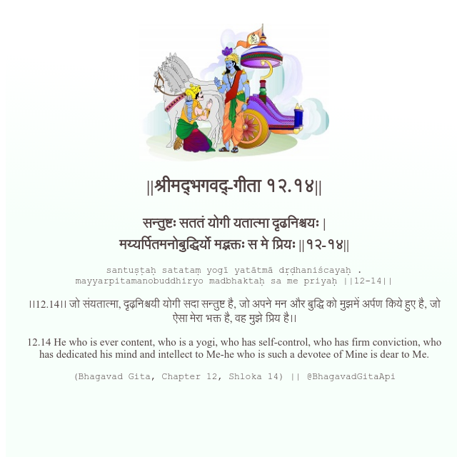

<h2>||श्रीमद्‍भगवद्‍-गीता १२.१४||</h2>
<h3>सन्तुष्टः सततं योगी यतात्मा दृढनिश्चयः | मय्यर्पितमनोबुद्धिर्यो मद्भक्तः स मे प्रियः ||१२-१४||</h3>
<pre>santuṣṭaḥ satataṃ yogī yatātmā dṛḍhaniścayaḥ . mayyarpitamanobuddhiryo madbhaktaḥ sa me priyaḥ ||12-14||</pre>

।।12.14।। जो संयतात्मा, दृढ़निश्चयी योगी सदा सन्तुष्ट है, जो अपने मन और बुद्धि को मुझमें अर्पण किये हुए है, जो ऐसा मेरा भक्त है, वह मुझे प्रिय है।।

<pre>(Bhagavad Gita, Chapter 12, Shloka 14) || @BhagavadGitaApi</pre>
https://bhagavadgitaapi.in/

#API #bhagavadgitaapi #slok #nodejs #js #api #gitaapi #krishna #hinduism #vedic #ISKCON #shreemadbhagavadgita #technology

