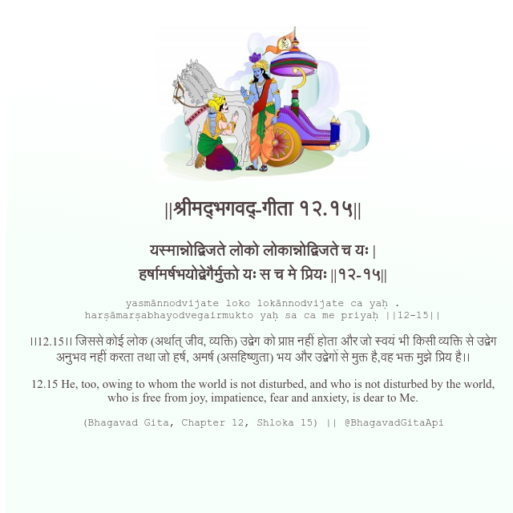

<h2>||श्रीमद्‍भगवद्‍-गीता १२.१५||</h2>
<h3>यस्मान्नोद्विजते लोको लोकान्नोद्विजते च यः | हर्षामर्षभयोद्वेगैर्मुक्तो यः स च मे प्रियः ||१२-१५||</h3>
<pre>yasmānnodvijate loko lokānnodvijate ca yaḥ . harṣāmarṣabhayodvegairmukto yaḥ sa ca me priyaḥ ||12-15||</pre>

।।12.15।। जिससे कोई लोक (अर्थात् जीव, व्यक्ति) उद्वेग को प्राप्त नहीं होता और जो स्वयं भी किसी व्यक्ति से उद्वेग अनुभव नहीं करता तथा जो हर्ष, अमर्ष (असहिष्णुता) भय और उद्वेगों से मुक्त है,वह भक्त मुझे प्रिय है।।

<pre>(Bhagavad Gita, Chapter 12, Shloka 15) || @BhagavadGitaApi</pre>
https://docs.bhagavadgitaapi.in/

#API #bhagavadgitaapi #slok #nodejs #js #api #gitaapi #krishna #hinduism #vedic #ISKCON #shreemadbhagavadgita #technology

