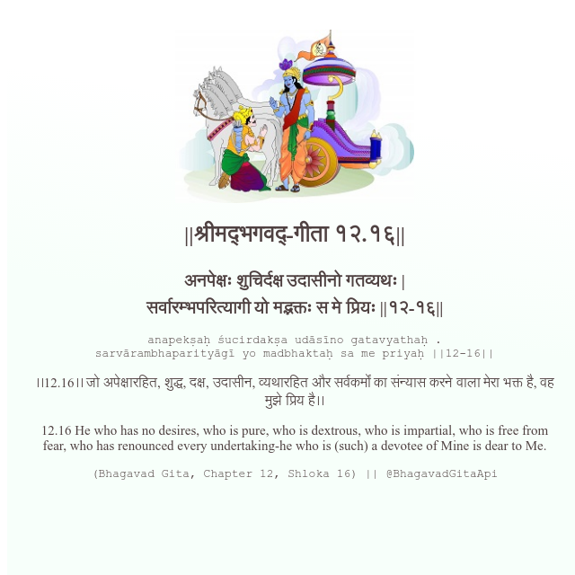

<h2>||श्रीमद्‍भगवद्‍-गीता १२.१६||</h2>
<h3>अनपेक्षः शुचिर्दक्ष उदासीनो गतव्यथः | सर्वारम्भपरित्यागी यो मद्भक्तः स मे प्रियः ||१२-१६||</h3>
<pre>anapekṣaḥ śucirdakṣa udāsīno gatavyathaḥ . sarvārambhaparityāgī yo madbhaktaḥ sa me priyaḥ ||12-16||</pre>

।।12.16।। जो अपेक्षारहित, शुद्ध, दक्ष, उदासीन, व्यथारहित और सर्वकर्मों का संन्यास करने वाला मेरा भक्त है, वह मुझे प्रिय है।।

<pre>(Bhagavad Gita, Chapter 12, Shloka 16) || @BhagavadGitaApi</pre>
https://docs.bhagavadgitaapi.in/

#API #bhagavadgitaapi #slok #nodejs #js #api #gitaapi #krishna #hinduism #vedic #ISKCON #shreemadbhagavadgita #technology

