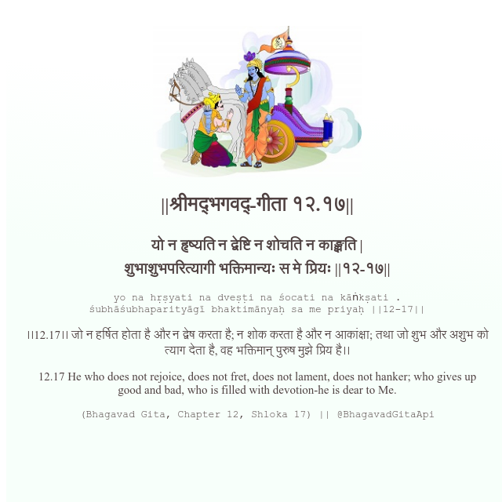

<h2>||श्रीमद्‍भगवद्‍-गीता १२.१७||</h2>
<h3>यो न हृष्यति न द्वेष्टि न शोचति न काङ्क्षति | शुभाशुभपरित्यागी भक्तिमान्यः स मे प्रियः ||१२-१७||</h3>
<pre>yo na hṛṣyati na dveṣṭi na śocati na kāṅkṣati . śubhāśubhaparityāgī bhaktimānyaḥ sa me priyaḥ ||12-17||</pre>

।।12.17।। जो न हर्षित होता है और न द्वेष करता है; न शोक करता है और न आकांक्षा; तथा जो शुभ और अशुभ को त्याग देता है, वह भक्तिमान् पुरुष मुझे प्रिय है।।

<pre>(Bhagavad Gita, Chapter 12, Shloka 17) || @BhagavadGitaApi</pre>
https://vedicscriptures.github.io/

#API #bhagavadgitaapi #slok #nodejs #js #api #gitaapi #krishna #hinduism #vedic #ISKCON #shreemadbhagavadgita #technology

