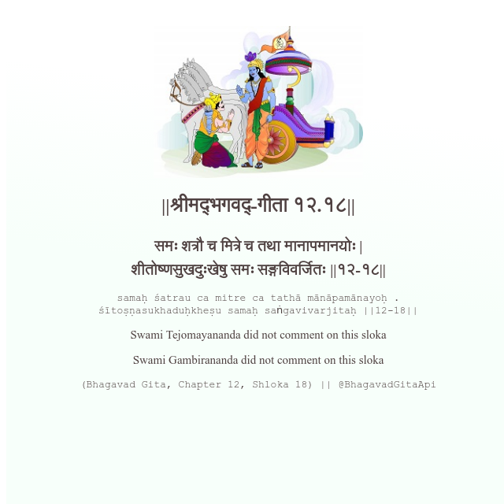

<h2>||श्रीमद्‍भगवद्‍-गीता १२.१८||</h2>
<h3>समः शत्रौ च मित्रे च तथा मानापमानयोः | शीतोष्णसुखदुःखेषु समः सङ्गविवर्जितः ||१२-१८||</h3>
<pre>samaḥ śatrau ca mitre ca tathā mānāpamānayoḥ . śītoṣṇasukhaduḥkheṣu samaḥ saṅgavivarjitaḥ ||12-18||</pre>

Swami Tejomayananda did not comment on this sloka

<pre>(Bhagavad Gita, Chapter 12, Shloka 18) || @BhagavadGitaApi</pre>
https://vedicscriptures.github.io/

#API #bhagavadgitaapi #slok #nodejs #js #api #gitaapi #krishna #hinduism #vedic #ISKCON #shreemadbhagavadgita #technology

