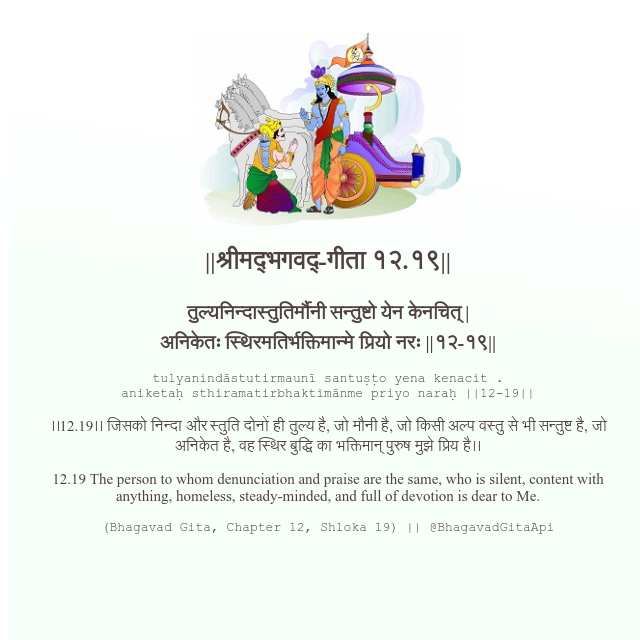

<h2>||श्रीमद्‍भगवद्‍-गीता १२.१९||</h2>
<h3>तुल्यनिन्दास्तुतिर्मौनी सन्तुष्टो येन केनचित् | अनिकेतः स्थिरमतिर्भक्तिमान्मे प्रियो नरः ||१२-१९||</h3>
<pre>tulyanindāstutirmaunī santuṣṭo yena kenacit . aniketaḥ sthiramatirbhaktimānme priyo naraḥ ||12-19||</pre>

।।12.19।। जिसको निन्दा और स्तुति दोनों ही तुल्य है, जो मौनी है, जो किसी अल्प वस्तु से भी सन्तुष्ट है, जो अनिकेत है, वह स्थिर बुद्धि का भक्तिमान् पुरुष मुझे प्रिय है।।

<pre>(Bhagavad Gita, Chapter 12, Shloka 19) || @BhagavadGitaApi</pre>
https://bhagavadgitaapi.in/

#API #bhagavadgitaapi #slok #nodejs #js #api #gitaapi #krishna #hinduism #vedic #ISKCON #shreemadbhagavadgita #technology

