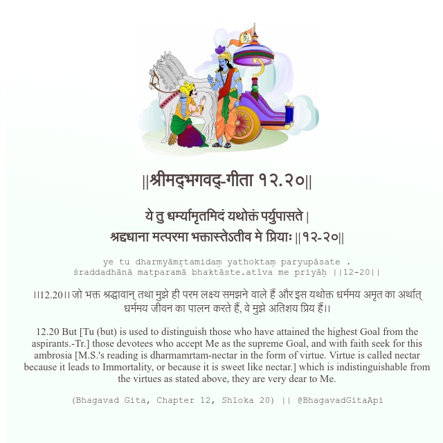

<h2>||श्रीमद्‍भगवद्‍-गीता १२.२०||</h2>
<h3>ये तु धर्म्यामृतमिदं यथोक्तं पर्युपासते | श्रद्दधाना मत्परमा भक्तास्तेऽतीव मे प्रियाः ||१२-२०||</h3>
<pre>ye tu dharmyāmṛtamidaṃ yathoktaṃ paryupāsate . śraddadhānā matparamā bhaktāste.atīva me priyāḥ ||12-20||</pre>

।।12.20।। जो भक्त श्रद्धावान् तथा मुझे ही परम लक्ष्य समझने वाले हैं और इस यथोक्त धर्ममय अमृत का अर्थात् धर्ममय जीवन का पालन करते हैं, वे मुझे अतिशय प्रिय हैं।।

<pre>(Bhagavad Gita, Chapter 12, Shloka 20) || @BhagavadGitaApi</pre>
https://docs.bhagavadgitaapi.in/

#API #bhagavadgitaapi #slok #nodejs #js #api #gitaapi #krishna #hinduism #vedic #ISKCON #shreemadbhagavadgita #technology

