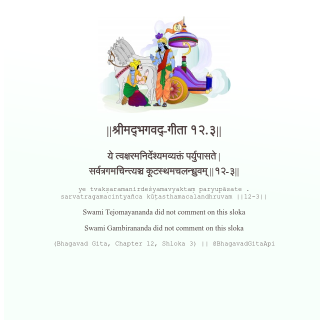

<h2>||श्रीमद्‍भगवद्‍-गीता १२.३||</h2>
<h3>ये त्वक्षरमनिर्देश्यमव्यक्तं पर्युपासते | सर्वत्रगमचिन्त्यञ्च कूटस्थमचलन्ध्रुवम् ||१२-३||</h3>
<pre>ye tvakṣaramanirdeśyamavyaktaṃ paryupāsate . sarvatragamacintyañca kūṭasthamacalandhruvam ||12-3||</pre>

Swami Tejomayananda did not comment on this sloka

<pre>(Bhagavad Gita, Chapter 12, Shloka 3) || @BhagavadGitaApi</pre>
https://vedicscriptures.github.io/

#API #bhagavadgitaapi #slok #nodejs #js #api #gitaapi #krishna #hinduism #vedic #ISKCON #shreemadbhagavadgita #technology

