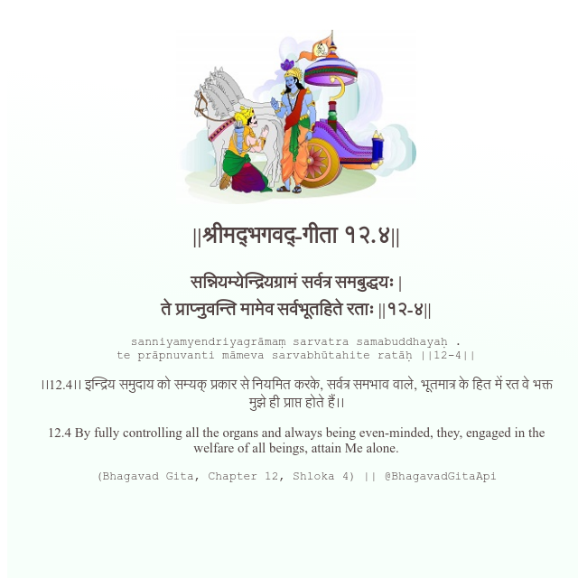

<h2>||श्रीमद्‍भगवद्‍-गीता १२.४||</h2>
<h3>सन्नियम्येन्द्रियग्रामं सर्वत्र समबुद्धयः | ते प्राप्नुवन्ति मामेव सर्वभूतहिते रताः ||१२-४||</h3>
<pre>sanniyamyendriyagrāmaṃ sarvatra samabuddhayaḥ . te prāpnuvanti māmeva sarvabhūtahite ratāḥ ||12-4||</pre>

।।12.4।। इन्द्रिय समुदाय को सम्यक् प्रकार से नियमित करके, सर्वत्र समभाव वाले, भूतमात्र के हित में रत वे भक्त मुझे ही प्राप्त होते हैं।।

<pre>(Bhagavad Gita, Chapter 12, Shloka 4) || @BhagavadGitaApi</pre>
https://bhagavadgitaapi.in/

#API #bhagavadgitaapi #slok #nodejs #js #api #gitaapi #krishna #hinduism #vedic #ISKCON #shreemadbhagavadgita #technology

