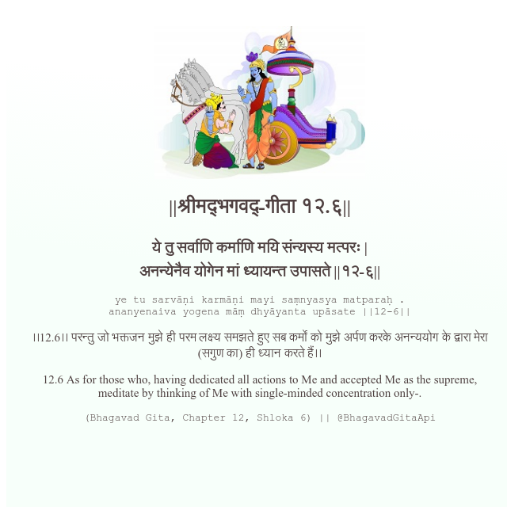

<h2>||श्रीमद्‍भगवद्‍-गीता १२.६||</h2>
<h3>ये तु सर्वाणि कर्माणि मयि संन्यस्य मत्परः | अनन्येनैव योगेन मां ध्यायन्त उपासते ||१२-६||</h3>
<pre>ye tu sarvāṇi karmāṇi mayi saṃnyasya matparaḥ . ananyenaiva yogena māṃ dhyāyanta upāsate ||12-6||</pre>

।।12.6।। परन्तु जो भक्तजन मुझे ही परम लक्ष्य समझते हुए सब कर्मों को मुझे अर्पण करके अनन्ययोग के द्वारा मेरा (सगुण का) ही ध्यान करते हैं।।

<pre>(Bhagavad Gita, Chapter 12, Shloka 6) || @BhagavadGitaApi</pre>
https://bhagavadgitaapi.in/

#API #bhagavadgitaapi #slok #nodejs #js #api #gitaapi #krishna #hinduism #vedic #ISKCON #shreemadbhagavadgita #technology

