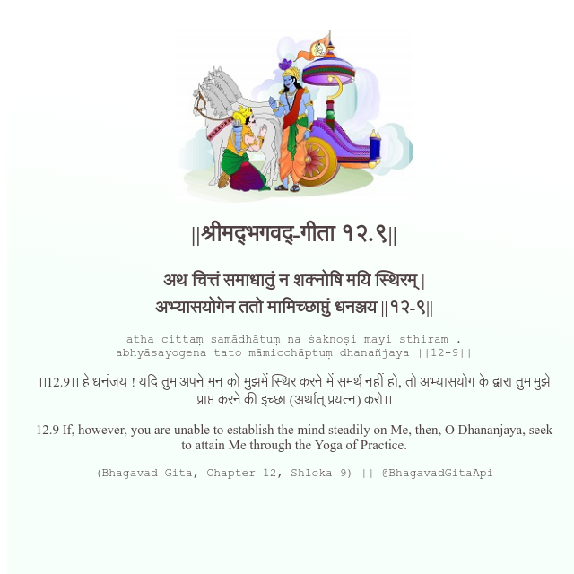

<h2>||श्रीमद्‍भगवद्‍-गीता १२.९||</h2>
<h3>अथ चित्तं समाधातुं न शक्नोषि मयि स्थिरम् | अभ्यासयोगेन ततो मामिच्छाप्तुं धनञ्जय ||१२-९||</h3>
<pre>atha cittaṃ samādhātuṃ na śaknoṣi mayi sthiram . abhyāsayogena tato māmicchāptuṃ dhanañjaya ||12-9||</pre>

।।12.9।। हे धनंजय ! यदि तुम अपने मन को मुझमें स्थिर करने में समर्थ नहीं हो, तो अभ्यासयोग के द्वारा तुम मुझे प्राप्त करने की इच्छा (अर्थात् प्रयत्न) करो।।

<pre>(Bhagavad Gita, Chapter 12, Shloka 9) || @BhagavadGitaApi</pre>
https://bhagavadgitaapi.in/

#API #bhagavadgitaapi #slok #nodejs #js #api #gitaapi #krishna #hinduism #vedic #ISKCON #shreemadbhagavadgita #technology

