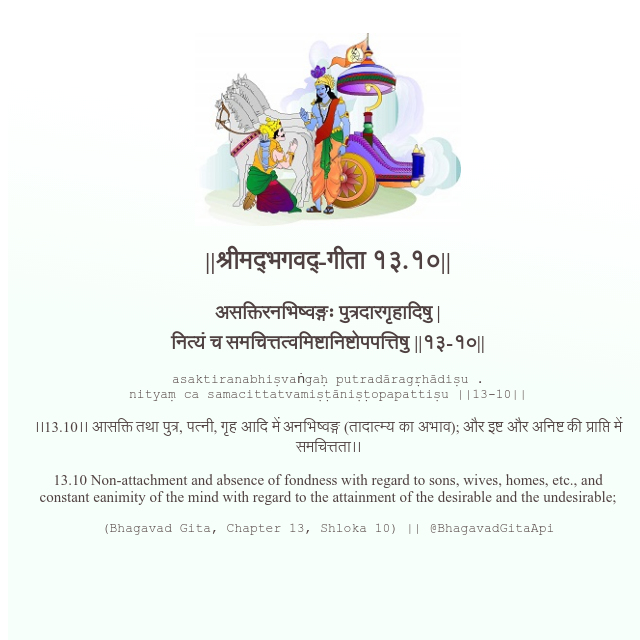

<h2>||श्रीमद्‍भगवद्‍-गीता १३.१०||</h2>
<h3>असक्तिरनभिष्वङ्गः पुत्रदारगृहादिषु | नित्यं च समचित्तत्वमिष्टानिष्टोपपत्तिषु ||१३-१०||</h3>
<pre>asaktiranabhiṣvaṅgaḥ putradāragṛhādiṣu . nityaṃ ca samacittatvamiṣṭāniṣṭopapattiṣu ||13-10||</pre>

।।13.10।। आसक्ति तथा पुत्र, पत्नी, गृह आदि में अनभिष्वङ्ग (तादात्म्य का अभाव); और इष्ट और अनिष्ट की प्राप्ति में समचित्तता।।

<pre>(Bhagavad Gita, Chapter 13, Shloka 10) || @BhagavadGitaApi</pre>
https://docs.bhagavadgitaapi.in/

#API #bhagavadgitaapi #slok #nodejs #js #api #gitaapi #krishna #hinduism #vedic #ISKCON #shreemadbhagavadgita #technology

