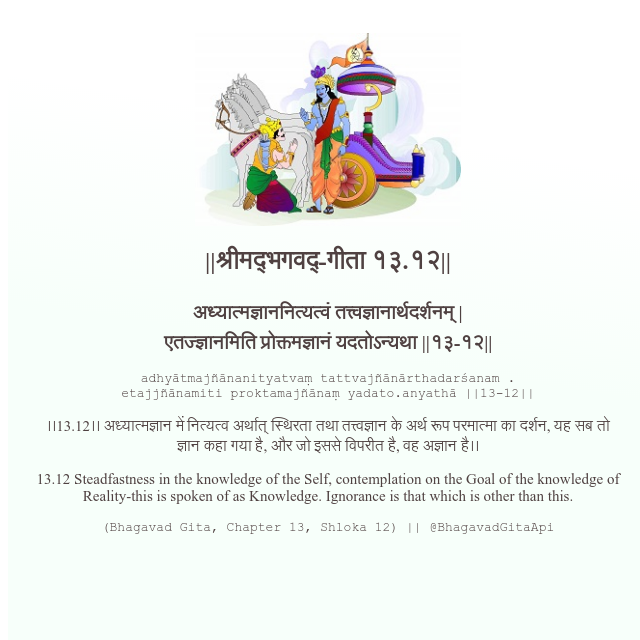

<h2>||श्रीमद्‍भगवद्‍-गीता १३.१२||</h2>
<h3>अध्यात्मज्ञाननित्यत्वं तत्त्वज्ञानार्थदर्शनम् | एतज्ज्ञानमिति प्रोक्तमज्ञानं यदतोऽन्यथा ||१३-१२||</h3>
<pre>adhyātmajñānanityatvaṃ tattvajñānārthadarśanam . etajjñānamiti proktamajñānaṃ yadato.anyathā ||13-12||</pre>

।।13.12।। अध्यात्मज्ञान में नित्यत्व अर्थात् स्थिरता तथा तत्त्वज्ञान के अर्थ रूप परमात्मा का दर्शन, यह सब तो ज्ञान कहा गया है, और जो इससे विपरीत है, वह अज्ञान है।।

<pre>(Bhagavad Gita, Chapter 13, Shloka 12) || @BhagavadGitaApi</pre>
https://bhagavadgitaapi.in/

#API #bhagavadgitaapi #slok #nodejs #js #api #gitaapi #krishna #hinduism #vedic #ISKCON #shreemadbhagavadgita #technology

